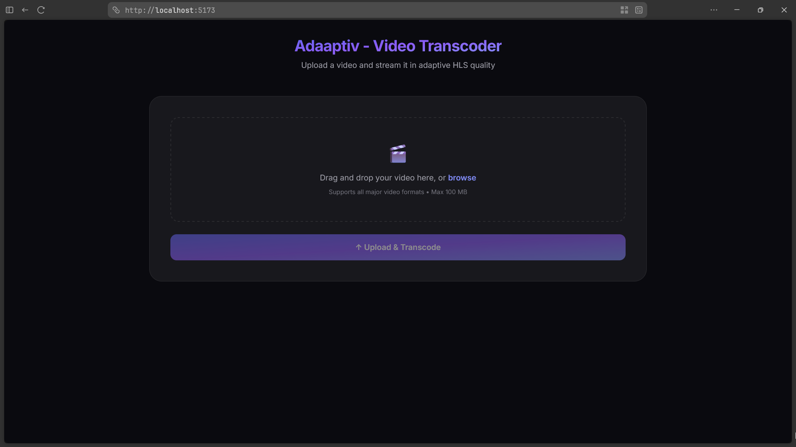
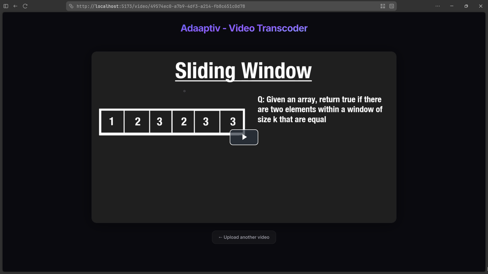
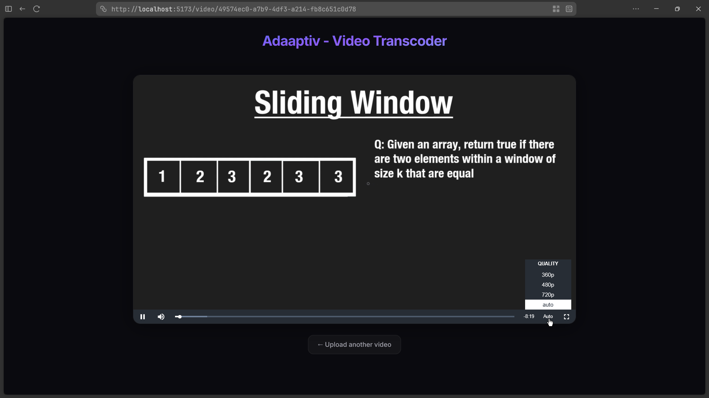
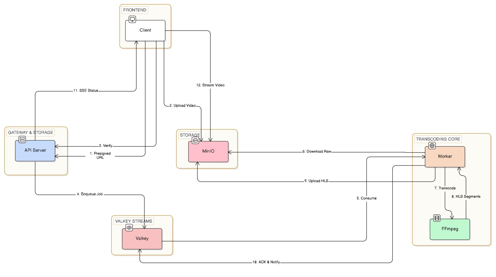

<div align="center">
  <h1>Adaaptiv - Video Transcoder</h1>
  <p>An adaptive video streaming platform for uploading, transcoding, and streaming videos using HLS.</p>

  <p>
    
    
    
    
    
    
    
  </p>
</div>

---

## Screenshots

<p align="center">
  
</p>
<p align="center">
  
</p>
<p align="center">
  
</p>

---

## Features

- **Presigned Uploads** - Clients upload directly to MinIO via presigned URLs, keeping video bytes off the API server.
- **Valkey Streams** - At-least-once message delivery through consumer groups with automatic pending entry recovery on worker restart.
- **Dead Letter Queue** - A background janitor re-claims stalled jobs and routes poison pills to a dedicated DLQ stream after repeated failures.
- **Dockerized FFmpeg** - Workers spawn FFmpeg containers to transcode into adaptive HLS renditions (360p, 480p, 720p) using H.265 + fMP4 for efficient delivery.
- **Direct S3 Streaming** - The streaming bucket is publicly readable so the frontend fetches HLS segments straight from MinIO.
- **Real-Time Updates** - Server-Sent Events powered by Valkey Pub/Sub notify clients the moment transcoding finishes.
- **Client-Side Validation** - 100 MB file size limit enforced in the frontend with server-side checks as a safety net.

---

### Architecture

<p align="center">
  
</p>

---

## Tech Stack

| Layer | Technology |
|-------|-----------|
| **Frontend** | React 19, Tailwind CSS v4, Video.js, Vite 7 |
| **API Server** | Go, Chi router, Valkey Pub/Sub |
| **Queue** | Valkey Streams (consumer groups, DLQ) |
| **Worker** | Go, Dockerized FFmpeg (H.265 + fMP4) |
| **Storage** | MinIO (S3-compatible) |
| **Infrastructure** | Docker, Docker Compose |

---

## Project Structure

```
.
├── cmd/
│   ├── api/                    # API server
│   │   ├── main.go             # Server initialization
│   │   ├── api.go              # Routes and middleware
│   │   ├── upload.go           # Presign + upload verification
│   │   ├── ssestatusHandler.go # SSE via Valkey Pub/Sub
│   │   └── Dockerfile
│   └── worker/                 # Stream consumer + DLQ janitor
│       ├── main.go             # Worker initialization
│       ├── config.go           # Consumer loop + janitor
│       ├── handler.go          # Transcode pipeline
│       └── Dockerfile
├── internal/
│   ├── env/                    # Environment variable helpers
│   ├── queue/                  # Stream constants + XADD
│   └── storage/                # MinIO client + bucket policies
├── web/
│   └── src/
│       ├── pages/              # UploadPage, PlayerPage
│       ├── components/         # Header, Upload, VideoPlayer
│       ├── config/             # Constants (API base, MinIO URL)
│       ├── App.tsx             # Router
│       └── index.css           # Tailwind v4 theme
├── scripts/                    # FFmpeg transcode scripts
├── docker-compose.yaml
└── README.md
```

---

## Getting Started

### Prerequisites

- [Docker](https://docs.docker.com/get-docker/) & [Docker Compose](https://docs.docker.com/compose/install/)
- [Go 1.25+](https://go.dev/dl/) (for local development)
- [Bun](https://bun.sh/) or [Node.js 22+](https://nodejs.org/) (for frontend development)

### Quick Start (Docker Compose)

```bash
git clone https://github.com/illumino7/video-transcoder.git
cd video-transcoder
docker compose up --build
```

| Service | URL |
|---------|-----|
| Frontend | [http://localhost:5173](http://localhost:5173) |
| API Server | [http://localhost:3030](http://localhost:3030) |
| MinIO Console | [http://localhost:9001](http://localhost:9001) |
| Redis Commander | [http://localhost:8081](http://localhost:8081) |

### Local Development

```bash
# Terminal 1 - Infrastructure
docker compose up valkey minio redis-commander

# Terminal 2 - API Server
go run ./cmd/api

# Terminal 3 - Worker
go run ./cmd/worker

# Terminal 4 - Frontend
cd web && bun install && bun run dev
```

---

## Environment Variables

| Variable | Default | Description |
|----------|---------|-------------|
| `ADDR` | `:3030` | API server listen address |
| `REDIS_ADDR` | `localhost:6379` | Valkey connection address |
| `MINIO_ENDPOINT` | `localhost:9000` | MinIO S3 endpoint |
| `MINIO_ACCESS_KEY` | `minioadmin` | MinIO access key |
| `MINIO_SECRET_KEY` | `minioadmin` | MinIO secret key |
| `MINIO_USE_SSL` | `false` | Enable TLS for MinIO |
| `WORKER_CONCURRENCY` | `2` | Number of concurrent worker goroutines |

---

## License

This project is for educational and portfolio purposes.
